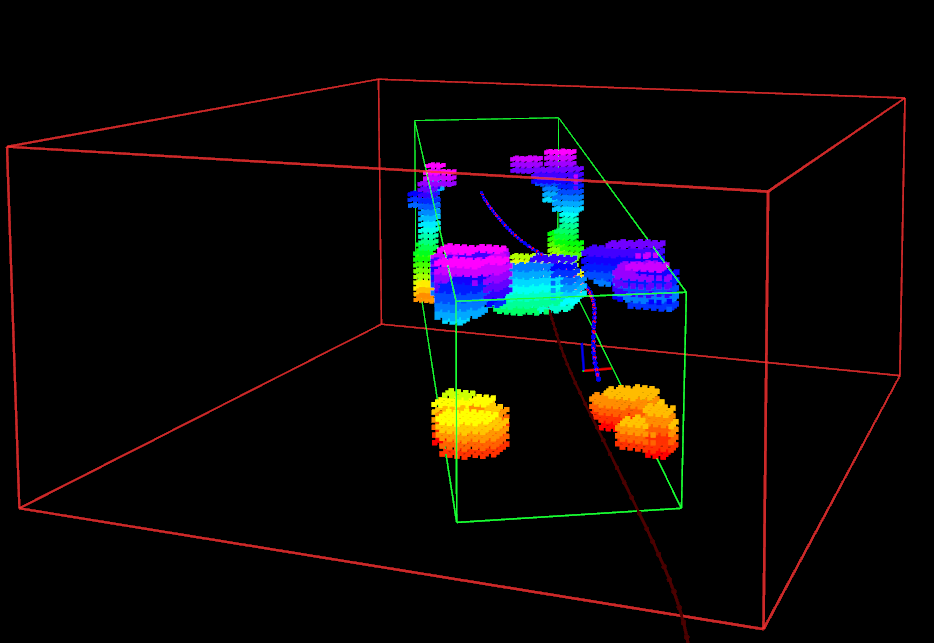
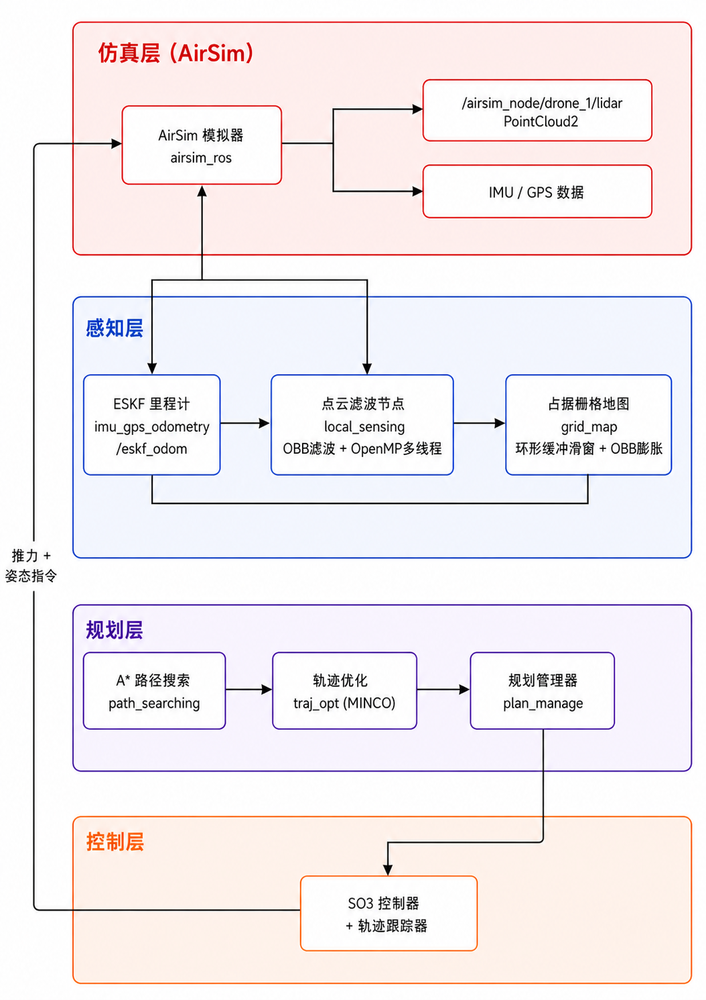
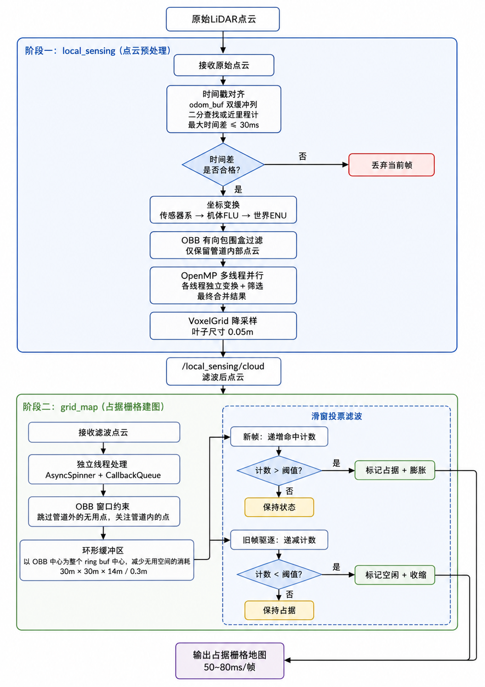
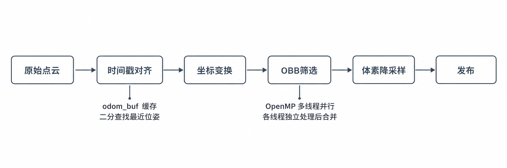
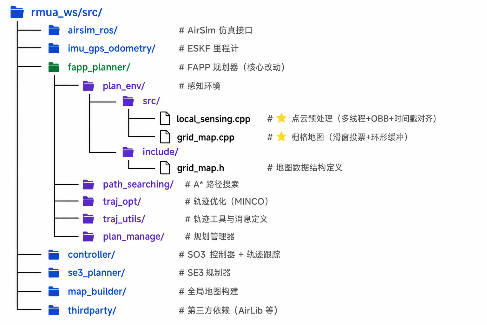

  
  
  
  
  

<h1 align="center">RMUA High-Speed Drone Racing</h1>

  <b>基于 FAPP 框架的高速无人机竞速系统 | 面向 10m/s 飞行速度挑战</b>

  <i>Docker + ROS1 | 感知优化 | 轨迹优化 | 实时避障</i>

---

## 项目概述

本项目面向 RMUA 无人机竞速赛，基于 [FAPP (Fast Autonomous Path Planner)](https://github.com/arclab-hku/FAPP) 开源框架进行深度优化，目标是在复杂赛道环境中实现 **10m/s** 的高速自主飞行。

原始 FAPP 代码仅能支持最高 **5m/s** 的飞行速度。为突破这一瓶颈，本项目从**感知**和**轨迹优化**两个维度进行了系统性改进，在grid_map上进行优化最终实现了在高速飞行条件下的稳定避障与赛道通过能力。

红色框为局部体素地图、绿色框为随轨道固定的obb筛选框
## 效果演示

### 核心成果

| 指标 | 原始 FAPP | 本项目 |
|:---:|:---:|:---:|
| 最大飞行速度 | 5 m/s | **10 m/s** |
| 局部地图尺寸 | 有限 | **30m × 30m × 14m** |
| 体素分辨率 | - | **0.3m** |
| 单帧建图耗时 | - | **50 ~ 80 ms** |
| 点云预处理 | 单线程 | **OpenMP 多线程** |
| 地图滤波 | 光线追踪 | **滑窗投票 + 击中触发** |

---

## 系统架构

---

## 感知优化详解

面向 10m/s 的飞行速度，感知系统需要在**尽可能远的距离**提前发现障碍物，为规划器争取足够的反应时间。本项目从点云预处理和栅格地图两个环节进行了深度优化。

### 感知处理流程

### 优化一：多线程点云筛选 (local_sensing)

**问题**：原始方案对全量点云进行处理，在高速飞行时计算量过大，延迟不可接受。

**方案**：仅针对赛道有效区域 (30m × 8m × 8m) 内的点云进行处理，大幅减少无效计算。

关键技术点：

- **时间戳对齐**：维护 `odom_buf` 双端队列缓存最近 1 秒的里程计数据，通过二分查找 (`std::lower_bound`) 找到与点云时间戳最接近的位姿，最大容忍时间差 30ms。解决高速机动时点云与位姿不同步导致的"点云晃动"问题。

- **OBB 有向包围盒过滤**：构建跟随全局轨迹方向的有向包围盒 (Oriented Bounding Box)，OBB 中心沿轨迹前方偏移，确保感知窗口始终覆盖飞行前方区域。仅保留 OBB 内部的点云，过滤掉赛道外的无效点。

- **OpenMP 多线程**：自动检测硬件线程数，将点云均匀分配到各线程，每个线程独立完成坐标变换 + OBB 检测，最后合并结果。当点云数量低于阈值 (`parallel_min_points`) 时自动退化为单线程，避免线程开销。

### 优化二：滑窗地图 + 击中触发滤波 (grid_map)

**问题**：高速飞行时机体剧烈机动，点云存在抖动噪声，直接建图会产生大量虚假障碍物。

**方案**：采用滑动窗口投票机制，只有在多帧中持续出现的体素才被标记为障碍物。

关键技术点：

- **环形缓冲区 (Ring Buffer)**：以 OBB 中心（而非无人机位置）为地图中心，使地图空间集中在飞行前方，不为无人机后方浪费体素。减少建图时缓冲区移动耗时。

- **滑窗投票滤波**：
  - 维护最近 N 帧的体素历史 (`frame_history_`)
  - 每个体素维护命中计数 (`sliding_hit_count_`)
  - 新帧到来：递增对应体素计数，达到阈值 (`min_hit`) 时标记为占据并膨胀
  - 最旧帧驱逐：递减对应体素计数，低于阈值时标记为空闲并收缩
  - 效果：单帧噪声点不会触发障碍物标记，有效过滤点云抖动

- **独立线程架构**：grid_map 使用独立的 `ros::CallbackQueue` + `AsyncSpinner`，与规划器主线程完全隔离，避免建图延迟影响规划频率。可视化同样使用独立线程。

---

## 轨迹优化
面向 10m/s 的飞行速度，对 FAPP 的轨迹优化模块进行参数整定：

| 参数类别 | 说明 |
|:---:|:---|
| **硬障碍物参数** | 调整安全距离与惩罚权重，确保高速下不碰撞 |
| **软障碍物参数** | 平衡避障裕度与路径效率 |
| **动力学可行性参数** | 匹配 10m/s 速度下的加速度 |
| **均匀性参数** | 保证轨迹段时间分配均匀，避免局部过快/过慢 |
| **时间性参数** | 优化总飞行时间，在安全前提下追求速度 |

通过以上参数整定，实现了高速飞行条件下的避障能力和赛道通过功能。

---

## 项目结构

---

## 基础框架

- **容器化部署**：采用 Docker 容器化方案，确保环境一致性与可复现性
- **ROS1 (Noetic)**：基于 ROS1 消息通信框架，各模块通过 Topic 解耦
- **AirSim 仿真**：使用 AirSim 提供高保真的无人机仿真环境与传感器数据
- **FAPP 源码移植**：基于hku的 FAPP 开源框架进行二次开发

---

## 致谢

- [FAPP - ZJU FAST-Lab](https://github.com/arclab-hku/FAPP) — 基础规划框架
- [AirSim - Microsoft](https://github.com/microsoft/AirSim) — 无人机仿真平台
